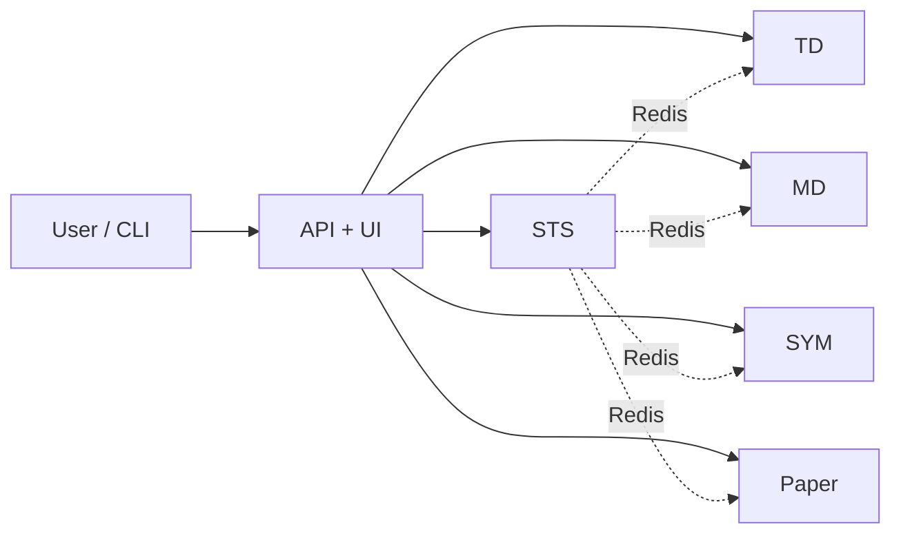

# Architecture

A node is one machine (or one compose project) that owns these planes. Domains do **not** import each other — they talk through Redis. A market-data restart is not supposed to take order entry with it; a strategy crash is not supposed to drop the venue connection.

## Planes

| Plane | Job |
|---|---|
| **STS** | Runs the strategy. One instance per session. Hooks, timers, OMS, ledger, tape. |
| **TD** | Venues. Places and cancels. Owns orders and balances. Lease fence on attach — only the session that holds it may trade. |
| **MD** | Public feeds, fan-out to sessions. Records tape so a later strategy can warm up on prints it was not running for. |
| **SYM** | Symbol plane (tick, step, min notional), independent of sessions. |
| **Paper** | Simulated venue in the same stack. Same ticker shape, same OMS path, no real money. |
| **API + UI** | Control plane. Browser for the operator, `mftik` CLI for the laptop that writes code. |

## Control flow

## Sessions, leases, tape

**Sessions** are the unit of work. Deploy from the STS page or `mftik run`. Live / Attention / History keep rows you must stop or ack out of last month's noise. A failed session keeps its reason until an operator acks it.

**Leases** fence the dangerous verbs. Only the process that holds the attach may place an order. Heartbeats expire; a ghost session does not keep trading.

**The tape** survives a restart. MD records `trade` / `aggtrade` while somebody holds the feed. `self.tape.read(...)` hands a later session the same objects the live hooks get, plus coverage — measured gaps included. Closing a short deploy hole is a handover, not an emergency.
